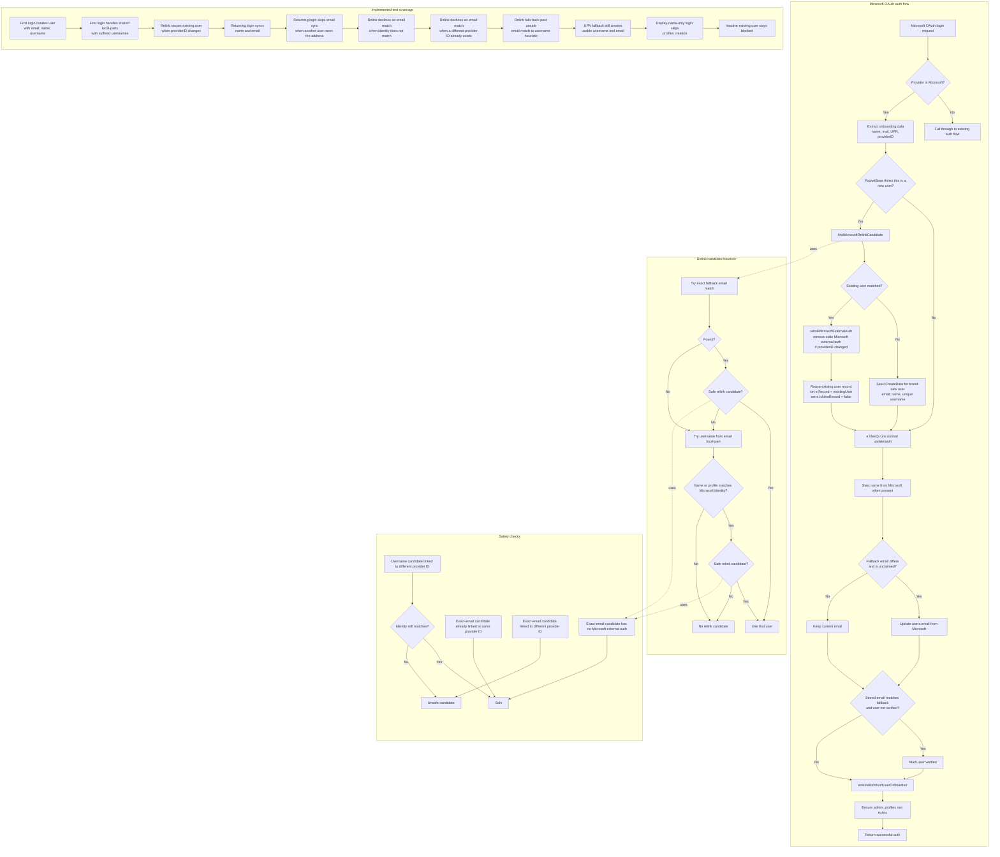

# Microsoft OAuth Users Flow

Status: Implemented
Last updated: 2026-04-01

## Summary

This document describes the implemented Microsoft OAuth user flow in Tybalt.

The current behavior covers three cases:

- first-time Microsoft login
- returning Microsoft login with the same provider ID
- relinking an existing PocketBase user when Microsoft presents a new provider ID for the same person

The flow is intentionally transactional and conservative. It keeps `users.username` stable after creation, syncs `users.name` and `users.email` from Microsoft on successful login, repairs verification when the trusted Microsoft email matches the stored email, and always ensures `admin_profiles` exists.

## What It Does

- First login seeds `users.email`, `users.name`, and `users.username` from Microsoft data.
- Returning login syncs `users.name` and `users.email` from Microsoft when safe to do so.
- Returning login keeps `users.username` unchanged.
- Provider-ID rotation can relink the login to an older existing `users` record instead of creating a duplicate.
- Relink deletes the stale Microsoft external auth row so PocketBase can attach the current provider ID inside the same auth transaction.
- Relink refuses to reuse an exact-email matched user that already has a different Microsoft `providerId`.
- Successful Microsoft auth continues to ensure `admin_profiles` exists.
- The flow never auto-creates a `profiles` row from Microsoft alone.

## Current Sync Policy

### Synced on first login

- `users.email`
- `users.name`
- `users.username`

### Synced on later successful Microsoft logins

- `users.name`
- `users.email`, but only if the target email is not already claimed by another user

### Not synced on later logins

- `users.username`
- `profiles.*`
- `admin_profiles.*` beyond ensuring the row exists

## Why Username Is Not Synced

`users.username` is currently treated as an app-owned stable identifier after first creation. The implemented flow still derives it from the Microsoft email local-part for brand-new users, but later Microsoft changes do not rename the app username. This avoids collisions and avoids surprising downstream code that effectively treats usernames as durable.

## Matching Heuristic

The relink candidate lookup is intentionally conservative:

1. Try an exact match on the fallback Microsoft email (`mail`, then `userPrincipalName`).
2. If that email-matched candidate is unsafe, keep searching instead of stopping the relink attempt.
3. Derive the username from the email local-part and look up a user by `username` when needed.
4. If the exact-email candidate is unsafe, continue to the username heuristic.
5. Only accept a candidate from the username heuristic when the Microsoft identity still matches either:
   - `users.name`, or
   - the linked `profiles.given_name` and `profiles.surname`

This is meant to catch legitimate provider-ID rotations and email-alias changes without broadly treating any similar Microsoft login as the same person.

## Transaction Flow

## Returning Login Behavior

When Microsoft returns the same provider ID on a later login:

- `users.name` is updated when Microsoft provides a non-empty full name that differs from the stored one
- `users.email` is updated when Microsoft provides a non-empty fallback email and no other user already owns it
- `users.username` is left unchanged
- if the final stored email matches the trusted Microsoft email, the user may be marked verified

This means later Microsoft directory changes such as a legal name update or email-alias update are now reflected in the PocketBase auth record, without treating username as mutable.

## Email Rules

On any successful Microsoft login, the app attempts to update `users.email` to the Microsoft fallback email if:

- Microsoft provided a non-empty fallback email
- that email differs from the current stored email
- no other user already owns that target email

Example:

- update `apico@tbte.onmicrosoft.com` to `apico@tbte.ca` when no other user owns `apico@tbte.ca`
- keep `apico@tbte.onmicrosoft.com` unchanged when another user already owns `apico@tbte.ca`

## Covered by Tests

The current tests cover:

- first login seeding email, name, username, verification, and `admin_profiles`
- username suffix allocation when two users share the same email local-part
- relinking an older migrated user when Microsoft returns a new provider ID
- returning-login sync for `users.name` and `users.email`
- skipping returning-login email sync when another user already owns the target email
- declining relink when an email-matched, already-linked Microsoft user no longer matches the incoming identity
- declining relink when an exact-email matched candidate already has a different Microsoft provider ID, even if the human identity matches
- falling back from an unsafe email-matched candidate to the username heuristic
- fallback to `userPrincipalName` when `mail` is absent
- display-name-only onboarding without creating a business `profiles` row
- blocking inactive existing users even if Microsoft auth succeeds

## Files

- `app/hooks/hooks.go`
- `app/hooks/oauth_onboarding.go`
- `app/oauth_onboarding_test.go`

## Operational Notes

For duplicate-user repairs, relink only runs when PocketBase would otherwise treat the Microsoft login as a new user. In practice, that means a bad existing external auth link or an exact `AuthUser.Email` match on the wrong duplicate can still prevent relink from selecting the intended older user before our helper runs. Inside the helper itself, though, an unsafe fallback-email candidate no longer aborts the search; the code now falls through to the username-based heuristic and can still recover the intended older user that way. That stricter stop only applies to the exact-email candidate, not to the later username-based stale-link recovery path.
