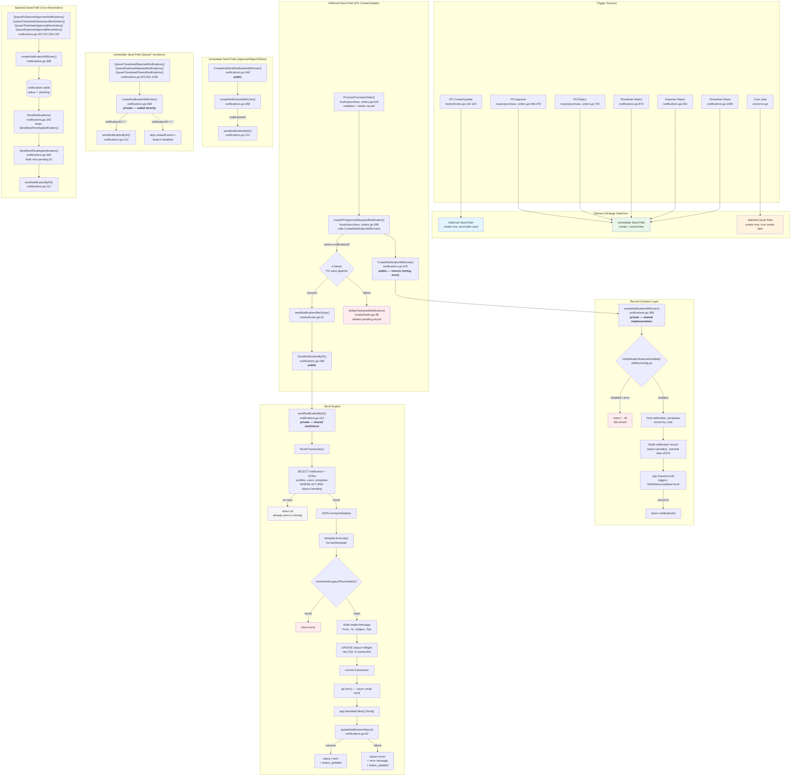

# Notification System

## Overview

The notification system lives in `app/notifications/notifications.go`. It creates notification records in the `notifications` table and delivers them as emails via the app's configured mail client. There are two delivery models:

1. **Immediate** — the notification is created and sent right away (used by event-driven paths like PO approval, rejection, timesheet sharing)
2. **Batched** — notifications are created in `pending` status and a cron job sends them later (used by periodic reminders)

## Status Lifecycle

Every notification record transitions through these statuses:

```text
pending → inflight → sent
                   → error
```

- **pending** — record created, awaiting delivery
- **inflight** — template rendered, email handed to SMTP goroutine
- **sent** — SMTP delivery succeeded
- **error** — SMTP delivery failed (error message stored in `error` column)

The `status_updated` column is set on every transition: by the `WriteStatusUpdated` hook for `pending` (on record creation), by `sendNotificationByID` raw SQL for `pending→inflight`, and by `updateNotificationStatus` raw SQL for `inflight→sent` and `inflight→error`.

## Architecture Diagram



## Function Reference

### Public API (`notifications` package)

| Function                            | Signature                                                                   | Description                                                                       |
|-------------------------------------|-----------------------------------------------------------------------------|-----------------------------------------------------------------------------------|
| `CreateNotification`                | `(app, templateCode, recipientUID, data, system) error`                     | Create-only. Discards notification ID. For callers that don't need deferred send. |
| `CreateNotificationWithUser`        | `(app, templateCode, recipientUID, data, system, actorUID) (string, error)` | Create-only. Returns notification ID for deferred send or cleanup.                |
| `CreateAndSendNotification`         | `(app, templateCode, recipientUID, data, system) error`                     | Create + immediate send. Delegates to `CreateAndSendNotificationWithUser`.        |
| `CreateAndSendNotificationWithUser` | `(app, templateCode, recipientUID, data, system, actorUID) error`           | Create + immediate send. Send errors are logged, not propagated.                  |
| `SendNotificationByID`              | `(app, notificationID) error`                                               | Send a specific pending notification. No-op if already sent or missing.           |
| `SendNextPendingNotification`       | `(app) (remaining int64, err error)`                                        | Pick and send the next pending notification. Returns remaining count.             |
| `SendNotifications`                 | `(app) (int64, error)`                                                      | Loop `SendNextPendingNotification` until no pending remain.                       |
| `BuildActionURL`                    | `(app, path) string`                                                        | Build absolute URL from app-relative path.                                        |
| `WriteStatusUpdated`                | `(app, e) error`                                                            | Hook: sets `status_updated` on status change or new record.                       |

### Private internals (`notifications` package)

| Function                      | Description                                                                                                                                               |
|-------------------------------|-----------------------------------------------------------------------------------------------------------------------------------------------------------|
| `createNotificationWithUser`  | Shared implementation for all Create variants. Checks feature flag, finds template, builds record, calls `app.Save()`. Returns `(notificationID, error)`. |
| `sendNotificationByID`        | Shared send workhorse. Transaction: fetch + render + inflight. Then async goroutine for SMTP.                                                             |
| `updateNotificationStatus`    | Raw SQL update of `status`, `error`, and `status_updated` after SMTP completes. Uses `NonconcurrentDB()` to avoid hook side-effects.                      |
| `unresolvedLegacyPlaceholder` | Safety check for `{APP_URL}` / `{:RECORD_ID}` in rendered text.                                                                                           |

### Queue functions (`notifications` package)

| Function                                   | Delivery  | Description                                                           |
|--------------------------------------------|-----------|-----------------------------------------------------------------------|
| `QueuePoSecondApproverNotifications`       | Batched   | Create notifications for second-stage approvers, optionally send all. |
| `QueueTimesheetSubmissionReminders`        | Batched   | Remind users missing timesheets. Dedup by week.                       |
| `QueueTimesheetSubmissionRemindersForWeek` | Batched   | Implementation for a specific week ending.                            |
| `QueueTimesheetApprovalReminders`          | Batched   | Remind managers of pending timesheets. Dedup by 24h window.           |
| `QueueExpenseApprovalReminders`            | Batched   | Remind managers of pending expenses. Dedup by 24h window.             |
| `QueueTimesheetRejectedNotifications`      | Immediate | Notify employee + rejector + manager on timesheet rejection.          |
| `QueueExpenseRejectedNotifications`        | Immediate | Notify employee + rejector + manager on expense rejection.            |
| `QueueTimesheetSharedNotifications`        | Immediate | Notify newly added timesheet viewers.                                 |

### Hook helpers (`hooks` package)

| Function                               | Description                                                                                                           |
|----------------------------------------|-----------------------------------------------------------------------------------------------------------------------|
| `sendNotificationAfterSave`            | Trigger `SendNotificationByID` after PO save succeeds. No-op if ID is empty. Logs send errors without propagating.    |
| `deleteOrphanedNotification`           | Delete a notification record whose PO save failed. Logs a warning on DB lookup failure (orphan may be sent by cron).  |
| `createPOApprovalRequiredNotification` | Create-only wrapper for `po_approval_required`. Returns notification ID for deferred send.                            |

## Key Design Decisions

### Deferred send for PO create/update hooks

`ProcessPurchaseOrder` runs in a pre-save request hook (before `e.Next()`). The notification record is created during validation so it can reference the PO ID, but email delivery is deferred until after `e.Next()` succeeds. If the save pipeline fails, `deleteOrphanedNotification` removes the pending record so the cron doesn't deliver it later.

### Immediate send for route handlers

PO approval, rejection, and the Queue* event-driven functions call `CreateAndSendNotificationWithUser` or `createNotificationWithUser` + `sendNotificationByID` directly. These run after the business record is already persisted, so there's no orphan risk.

### Raw SQL for post-send status updates

`updateNotificationStatus` uses `NonconcurrentDB()` with raw SQL instead of `app.Save()` to avoid triggering PocketBase model/record hooks from an async goroutine. It explicitly sets `status_updated` in the SQL since the `WriteStatusUpdated` hook won't fire.

### Feature flags (fail-closed)

`createNotificationWithUser` checks `IsNotificationFeatureEnabled()` before creating a record. If the config read fails, it returns `("", nil)` — skipping creation silently. This keeps business workflows non-blocking while ensuring notifications are never sent unless explicitly enabled.

### createdCount accuracy in Queue* functions

The immediate-send Queue* functions (`QueueTimesheetRejected`, `QueueExpenseRejected`, `QueueTimesheetShared`) call `createNotificationWithUser` directly and only increment `createdCount` when `notificationID != ""`. This prevents inflated counts when the feature is disabled.
