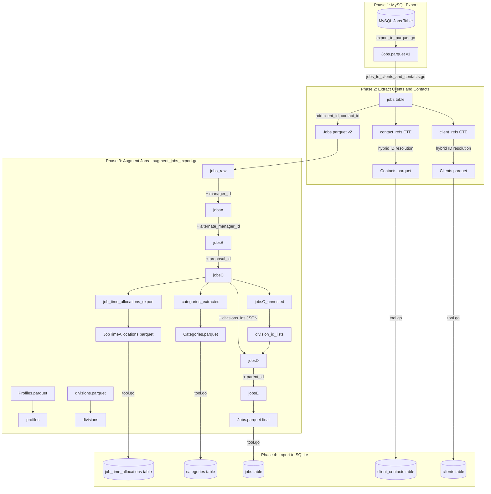

# Jobs Import Pipeline

This document explains how Jobs, Clients, Contacts, Categories, and JobTimeAllocations are exported from MySQL and imported into SQLite.

## Overview

The import pipeline has four phases:

1. **MySQL Export** - Raw data extracted from MySQL to Parquet
2. **Extract Clients/Contacts** - Normalize embedded client/contact names into separate tables
3. **Augment Jobs** - Resolve Firebase UIDs to PocketBase IDs, extract divisions and categories
4. **Import to SQLite** - Load final Parquet files into the target database

## Data Flow Diagram

## Phase Details

### Phase 1: MySQL Export (`extract/export_to_parquet.go`)

Connects to MySQL via SSH tunnel and exports the Jobs table to `parquet/Jobs.parquet`. The export includes all fields from MySQL, including:

- `client`, `clientContact`, `jobOwner` - String names (denormalized)
- `clientId`, `clientContactId`, `jobOwnerId` - PocketBase IDs (for Turbo-created jobs)
- `managerUid`, `alternateManagerUid` - Legacy Firebase UIDs
- `divisions` - Comma-separated division codes (e.g., "ES,NRG,GEO")
- `categories` - Comma-separated category names
- `jobTimeAllocations` - JSON object mapping division codes to hours (e.g., `{"ES": 100, "NRG": 50}`)

### Phase 2: Extract Clients and Contacts (`extract/jobs_to_clients_and_contacts.go`)

Normalizes the embedded client and contact names from Jobs into separate tables.

**Hybrid ID Resolution** - For each client/contact reference, IDs are resolved in priority order:

1. **Preserved ID**: Use `clientId`/`jobOwnerId`/`clientContactId` if populated (from Turbo writeback)
2. **Exact Name Match**: If no preserved ID but exactly one TurboClient exists with the same name, use that ID
3. **Generated ID**: Fallback to deterministic MD5-based ID from the name

This ensures:
- Turbo-created jobs preserve their original PocketBase IDs
- Legacy jobs link to existing Turbo clients when names match exactly
- Consistent generated IDs for truly new clients

**Outputs:**
- `Clients.parquet` - Unique clients extracted from `client` and `jobOwner` fields
- `Contacts.parquet` - Unique contacts with `surname`, `givenName`, `email`, `client_id`
- `Jobs.parquet` v2 - Updated with `client_id`, `contact_id`, `job_owner_id` columns

### Phase 3: Augment Jobs (`extract/augment_jobs_export.go`)

Transforms legacy Firebase UIDs into PocketBase IDs and extracts normalized data.

**Intermediate Tables:**

| Table | Purpose | Fields Added |
|-------|---------|--------------|
| `jobs_raw` | Load Jobs.parquet v2 | (base data) |
| `jobsA` | Join with profiles on `managerUid` | `manager_id` (PocketBase UID) |
| `jobsB` | Join with profiles on `alternateManagerUid` | `alternate_manager_id` |
| `jobsC` | Self-join to resolve `proposal` job number to ID | `proposal_id` |
| `jobsC_unnested` | Explode comma-separated `divisions` into rows | (helper) |
| `division_id_lists` | Aggregate division IDs back into lists per job | (helper) |
| `jobsD` | Attach division IDs as JSON array | `divisions_ids` |
| `jobsE` | Derive parent job ID for sub-jobs (e.g., "24-105-1" → "24-105") | `parent_id` |

**Additional Outputs:**

- `Categories.parquet` - Extracted from comma-separated `categories` field
- `JobTimeAllocations.parquet` - Contains `job`, `division`, `hours`. Parsed from `jobTimeAllocations` JSON field when present; falls back to `divisions` field with hours=0 for legacy jobs created in Firestore (which have no `jobTimeAllocations` property)

### Phase 4: Import to SQLite (`tool.go`)

Loads all Parquet files into the target SQLite database using `INSERT OR REPLACE` for idempotency.

**Import Order** (respects foreign key dependencies):

1. `clients` - No dependencies
2. `client_contacts` - References `clients`
3. `jobs` - References `clients`, `client_contacts`, `branches`
4. `job_time_allocations` - References `jobs`, `divisions`
5. `categories` - References `jobs`

## Key Files

- `extract/export_to_parquet.go` - MySQL → Parquet export
- `extract/jobs_to_clients_and_contacts.go` - Client/contact normalization
- `extract/augment_jobs_export.go` - UID resolution and data extraction
- `load/load_from_parquet.go` - Generic Parquet → SQLite loader
- `tool.go` - Main import orchestration
