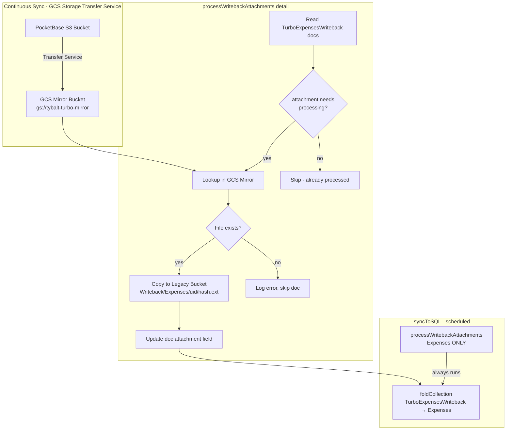
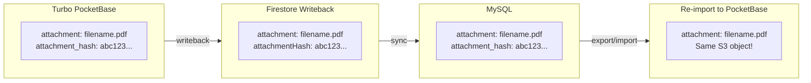

# Attachment Writeback Migration

## Overview

This document describes the system for syncing attachments from PocketBase (S3) back to Firebase Storage (GCS) as part of the Expenses writeback system. This enables rollback capability during the migration period.

**Important:** Expenses and Purchase Orders have different attachment handling:
- **Expenses**: Files are copied to Firebase Storage (legacy UI displays them)
- **Purchase Orders**: No file copying - attachment fields pass through as strings (no legacy UI, S3 files remain in place)

---

## Architecture

### Expenses (File Copying Required)



### Purchase Orders (No File Copying)



PO attachment fields are **reference-only strings** that pass through unchanged. The S3 files remain in place and get re-referenced on import.

---

## Attachment Path Formats

### Expenses (File Copying)

| Context | Format | Example |
|---------|--------|---------|
| **Legacy Tybalt (GCS)** | `{Collection}/{uid}/{sha256hash}.{ext}` | `Expenses/abc123uid/8f4e2d1a7b3c...f9.pdf` |
| **PocketBase (S3)** | `{collection_id}/{record_id}/{filename}` | `o1vpz1mm7qsfoyy/rec123/fn5k3_receipt.pdf` |
| **Writeback (GCS)** | `Writeback/{Collection}/{uid}/{sha256hash}.{ext}` | `Writeback/Expenses/abc123uid/8f4e2d1a7b3c...f9.pdf` |

The `Writeback/` prefix provides clear visibility into which attachments were created via the writeback system vs original legacy uploads.

### Purchase Orders (No File Copying)

| Context | Format | Notes |
|---------|--------|-------|
| **PocketBase (S3)** | `{collection_id}/{record_id}/{filename}` | Files stored here permanently |
| **Firestore/MySQL** | `{filename}` (string only) | Reference-only, no corresponding GCS file |
| **Re-import** | `{filename}` | Same filename → same S3 object |

PO attachments never exist in Firebase Storage. The attachment field is just a string that references the S3 object.

---

## Prerequisites

Complete these in order before enabling attachment writeback.

### 1. Add attachment_hash to Purchase Orders ✅ COMPLETE

**Schema Migration** ✅ COMPLETE

Migration `1769098274_updated_purchase_orders.go` adds:
- `attachment_hash` text field to purchase_orders
- Unique index `idx_Ml6Pmg44QP` on `attachment_hash` (where non-empty)

**Hook Implementation** ✅ COMPLETE

- Moved `CalculateFileFieldHash` to shared `app/hooks/helper.go`
- Updated `app/hooks/expenses.go` to use shared function
- Added hash computation to `ProcessPurchaseOrder` in `app/hooks/purchase_orders.go`

---

### 2. Fix Import to Populate attachment_hash for Migrated Expenses ✅ COMPLETE

**Changes made:**

1. **load_from_parquet.go** - Added `OriginalAttachment` field to Expense struct:
   ```go
   OriginalAttachment  string    `parquet:"attachment"` // Original Firebase Storage path
   ```

2. **tool.go** - Added hash extraction in expense binder:
   ```go
   "attachment_hash": func() string {
       if item.OriginalAttachment == "" {
           return ""
       }
       filename := path.Base(item.OriginalAttachment)
       return strings.TrimSuffix(filename, path.Ext(filename))
   }(),
   ```

3. **tool.go** - Added `attachment_hash` column to INSERT SQL

**Backfill:** Not needed separately - re-running `--export --import` pipeline will populate `attachment_hash` for all migrated expenses.

---

### 3. Add attachment_hash to Purchase Order Import ✅ N/A

**Not applicable** - Purchase Order attachments only exist in Turbo. There are no legacy PO attachments to import, so no import changes are needed.

The `attachment_hash` field and computation hook added in Prerequisite 1 handles all PO attachments created in Turbo.

---

### 4. Update Writeback Endpoint to Include attachment_hash ✅ COMPLETE

**Changes made to `app/routes/expenses_writeback.go`**:

1. Added `AttachmentHash` field to:
   - `expenseExportDBRow` struct (DB scanning)
   - `expenseExportOutput` struct (JSON output)
   - `purchaseOrderExportDBRow` struct (DB scanning)
   - `purchaseOrderExportOutput` struct (JSON output)

2. Updated SQL queries to include:
   - `COALESCE(e.attachment_hash, '') AS attachment_hash` for expenses
   - `COALESCE(po.attachment_hash, '') AS attachment_hash` for purchase orders

3. Updated mappings to include `AttachmentHash` in output

---

### 5. Set Up GCS Storage Transfer Service

#### Create Mirror Bucket ✅ COMPLETE

Mirror bucket created: `gs://tybalt-turbo-mirror`

#### Configure Storage Transfer Service ✅ COMPLETE

Storage Transfer Service configured and replicating from PocketBase S3 to `gs://tybalt-turbo-mirror`.

#### Verify Transfer ✅ VERIFIED

Files confirmed appearing in the mirror bucket.

```bash
# List objects in mirror bucket
gsutil ls gs://tybalt-turbo-mirror/o1vpz1mm7qsfoyy/

# Compare counts
gsutil ls -r gs://tybalt-turbo-mirror/ | wc -l
aws s3 ls s3://your-pocketbase-bucket/ --recursive | wc -l
```

---

## Implementation

### New File: `backend/functions/src/attachmentWriteback.ts` ✅ IMPLEMENTED

**Note:** This only handles Expenses. Purchase Orders do not require file copying.

**Key implementation details:**
- Uses `FIREBASE_CONFIG.storageBucket` for legacy bucket name
- Uses `data.immutableID || doc.id` for PocketBase record ID (immutableID = PocketBase record ID in writeback)
- Skips already-processed docs (attachment starts with `Writeback/` or `Expenses/`)
- Partial processing: continues on errors, returns counts

See actual implementation in `backend/functions/src/attachmentWriteback.ts`.

---

### Update `backend/functions/src/sync.ts` ✅ IMPLEMENTED

Attachment processing is called before the expenses fold. See actual implementation in `sync.ts`.

**Note:** The `preserveFields` array for the fold still needs `exported` and `exportInProgress` added (separate TODO).

---

### Update Export to Normalize Attachment Paths ✅ IMPLEMENTED

**Location:** `import_data/extract/augment_expenses.go`

Strips `Writeback/` prefix during augmentation:

```go
UPDATE expenses
SET attachment = SUBSTR(attachment, 11)
WHERE attachment LIKE 'Writeback/%'
```

This ensures parquet always contains normalized paths (`Expenses/{uid}/{hash}.{ext}`).

---

### Resilient GCS Resolution in attachments.go ✅ IMPLEMENTED

**Location:** `import_data/attachments/attachments.go`

Added `gcsSourceCandidates()` function that returns prioritized paths to try:
- For normalized path `Expenses/...`: tries legacy first, then `Writeback/Expenses/...`
- For prefixed path `Writeback/...`: tries prefixed first, then trimmed legacy

This ensures files are found regardless of whether they originated in legacy Tybalt or were written back from Turbo.

---

## Processing Flow Summary

### Expenses (File Copying)

```
┌─────────────────────────────────────────────────────────────────┐
│                    CONTINUOUS (Background)                       │
├─────────────────────────────────────────────────────────────────┤
│  PocketBase S3  ──[Storage Transfer Service]──▶  GCS Mirror     │
│  (writes)                (every 15 min)           (read-only)   │
└─────────────────────────────────────────────────────────────────┘

┌─────────────────────────────────────────────────────────────────┐
│                    syncToSQL (Scheduled M-F)                    │
├─────────────────────────────────────────────────────────────────┤
│  1. processExpenseWritebackAttachments()                        │
│     - Read TurboExpensesWriteback docs                          │
│     - For each with PocketBase attachment:                      │
│       - Lookup in GCS Mirror                                    │
│       - Copy to Legacy Bucket (Writeback/Expenses/uid/hash.ext) │
│       - Update doc attachment field                             │
│     - Partial success OK, log errors                            │
│                                                                 │
│  2. foldCollection(TurboExpensesWriteback → Expenses)           │
│     - Skipped if Config/Enable.expenses = true                  │
│     - Processed docs have correct attachment paths              │
│                                                                 │
│  3. exportExpenses() to MySQL                                   │
└─────────────────────────────────────────────────────────────────┘

### Purchase Orders (No File Copying)

┌─────────────────────────────────────────────────────────────────┐
│                    syncToSQL (Scheduled M-F)                    │
├─────────────────────────────────────────────────────────────────┤
│  1. NO processWritebackAttachments for POs                      │
│     - attachment field stays as PocketBase filename             │
│     - attachmentHash field passes through unchanged             │
│                                                                 │
│  2. exportTurboPurchaseOrders() to MySQL                        │
│     - Includes attachment and attachment_hash columns           │
│     - Values are reference strings to S3 objects                │
└─────────────────────────────────────────────────────────────────┘

┌─────────────────────────────────────────────────────────────────┐
│                    tool.go --export/--import                    │
├─────────────────────────────────────────────────────────────────┤
│  PO attachment fields pass through unchanged:                   │
│  - attachment: PocketBase filename (e.g., "abc123_quote.pdf")   │
│  - attachment_hash: SHA256 hash                                 │
│  On re-import, same filename → same existing S3 object          │
└─────────────────────────────────────────────────────────────────┘
```

┌─────────────────────────────────────────────────────────────────┐
│                    tool.go --export (Manual)                    │
├─────────────────────────────────────────────────────────────────┤
│  - Export Firestore → Parquet                                   │
│  - Normalize: Strip "Writeback/" prefix from attachment paths   │
│  - Output: Standard paths like "Expenses/uid/hash.ext"          │
└─────────────────────────────────────────────────────────────────┘

┌─────────────────────────────────────────────────────────────────┐
│                    tool.go --import (Manual)                    │
├─────────────────────────────────────────────────────────────────┤
│  - Import Parquet → PocketBase SQLite                           │
│  - attachment field: PocketBase filename (path.Base)            │
│  - attachment_hash field: Extracted from original path          │
└─────────────────────────────────────────────────────────────────┘

┌─────────────────────────────────────────────────────────────────┐
│                    attachments.go (Manual)                      │
├─────────────────────────────────────────────────────────────────┤
│  - Reads normalized paths from parquet                          │
│  - Copies GCS → S3 with consistent naming                       │
│  - Works identically for original and writeback attachments     │
└─────────────────────────────────────────────────────────────────┘
```

---

## Idempotency Guarantees

### Expenses

| Operation                          | Idempotency Mechanism                                                       |
|------------------------------------|-----------------------------------------------------------------------------|
| Storage Transfer                   | Overwrites if different, skips if same                                      |
| processExpenseWritebackAttachments | Skips docs where attachment already starts with `Writeback/` or `Expenses/` |
| File copy to legacy bucket         | Checks if destination exists before copying                                 |
| foldCollection                     | Uses document matching, no duplicate creates                                |
| attachments.go                     | Pre-fetches S3 objects, skips existing                                      |

### Purchase Orders

| Operation        | Idempotency Mechanism                                      |
|------------------|------------------------------------------------------------|
| Writeback sync   | Overwrites Firestore docs with same ID                     |
| MySQL export     | UPSERT pattern                                             |
| tool.go --import | Same filename references same S3 object (files never move) |

---

## Error Handling

### Expenses (processExpenseWritebackAttachments)

| Scenario                   | Behavior                                                   |
|----------------------------|------------------------------------------------------------|
| File not in GCS mirror yet | Log error, skip document, continue processing others       |
| Missing attachmentHash     | Log error, skip document, continue processing others       |
| Missing uid                | Log error, skip document, continue processing others       |
| Copy fails                 | Log error, skip document, continue processing others       |
| All documents error        | Return error counts, fold still runs (but no docs to fold) |

The system uses **partial processing**: process what we can, skip problematic documents, and let the fold run for successfully processed documents. Subsequent runs will retry failed documents.

### Purchase Orders

No special error handling needed - attachment fields are just strings that pass through. If the S3 file is missing, that's a separate data integrity issue unrelated to the writeback process.

---

## Checklist

### Prerequisites (Complete Before Enabling)

- [x] Add `attachment_hash` field to purchase_orders schema (migration `1769098274_updated_purchase_orders.go`)
- [x] Add `attachment_hash` computation hook to purchase_orders.go
- [x] Update expense import to populate `attachment_hash` from original path
- [x] Backfill `attachment_hash` for existing migrated expenses (via re-running --export --import)
- [x] Update `expenses_writeback.go` to include `attachmentHash` in response (expenses and POs)
- [x] Create GCS mirror bucket (`gs://tybalt-turbo-mirror`)
- [x] Configure Storage Transfer Service (S3 → GCS)
- [x] Verify transfer is working (files appearing in mirror)

### Implementation - Expenses (File Copying)

- [x] Create `attachmentWriteback.ts` with `processExpenseWritebackAttachments()`
- [x] Update `sync.ts` to call `processExpenseWritebackAttachments()` before expenses fold
- [x] Update export logic to normalize attachment paths (strip `Writeback/`)
- [ ] Test end-to-end with a single expense

### Implementation - Purchase Orders (String Pass-through)

- [x] Update MySQL `TurboPurchaseOrders` schema: add `attachment` and `attachment_hash` columns
- [x] Update `sync.ts` `exportTurboPurchaseOrders()` to include attachment fields
- [x] Update `load_from_parquet.go` PurchaseOrder struct with attachment fields
- [x] Update `tool.go` PO import binder to include attachment fields
- [x] Update `export_to_parquet.go` to export TurboPurchaseOrders from MySQL
- [x] Update `tool.go` to import from TurboPurchaseOrders.parquet (upsert after legacy POs)

### Validation - Expenses

- [ ] Create test expense in Turbo with attachment
- [ ] Verify hash is computed and stored
- [ ] Trigger writeback sync
- [ ] Verify file appears in GCS mirror
- [ ] Verify file is copied to legacy bucket with `Writeback/` prefix
- [ ] Verify Firestore doc attachment field is updated
- [ ] Verify fold works correctly
- [ ] Verify export normalizes the path
- [ ] Verify re-import handles the normalized path

### Validation - Purchase Orders

- [ ] Create test PO in Turbo with attachment
- [ ] Verify hash is computed and stored
- [ ] Trigger writeback sync
- [ ] Verify Firestore doc has attachment filename and hash
- [ ] Verify MySQL has attachment filename and hash
- [ ] Verify export includes attachment fields in parquet
- [ ] Verify re-import references same S3 object

---

## Rollback

### Expenses

If issues occur:

1. **Disable fold**: Set `Config/Enable.expenses = true` (fold becomes no-op)
2. **Attachment processing still runs** but documents stay in staging
3. **Investigate errors** in Cloud Functions logs
4. **Fix and retry**: Attachment processing is idempotent

To fully disable expense attachment processing, comment out the `processExpenseWritebackAttachments()` call in `sync.ts`.

### Purchase Orders

No special rollback needed - attachment fields are just strings. If there are issues:

1. The S3 files remain in place (never moved or copied)
2. Fix the writeback/export/import code as needed
3. Re-run the pipeline
